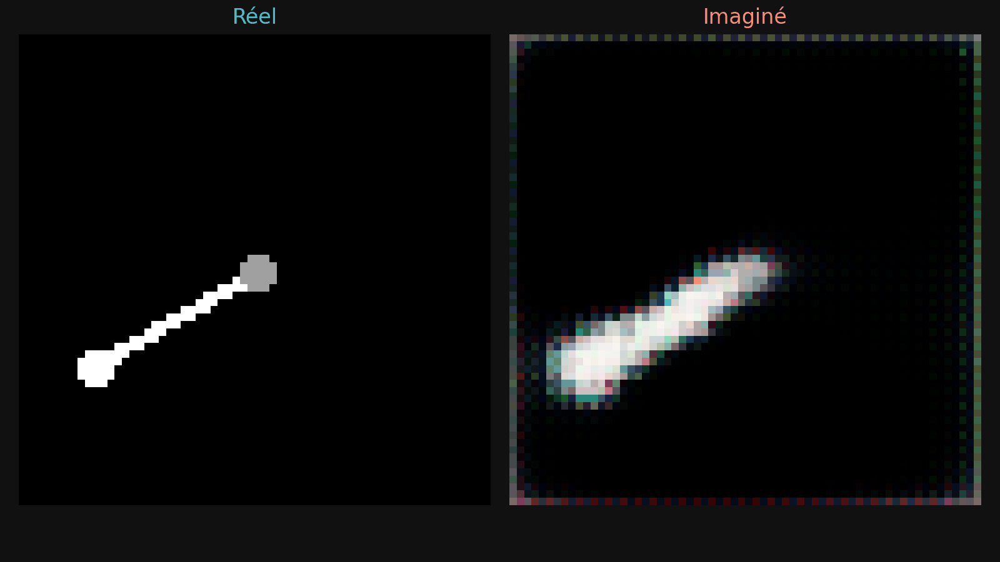
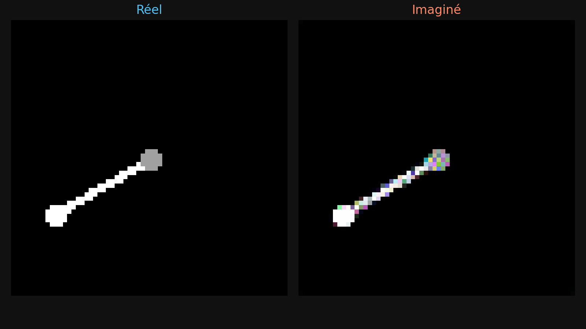
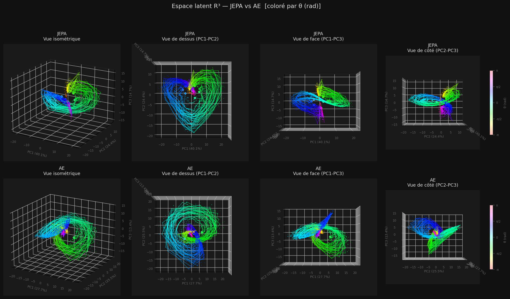
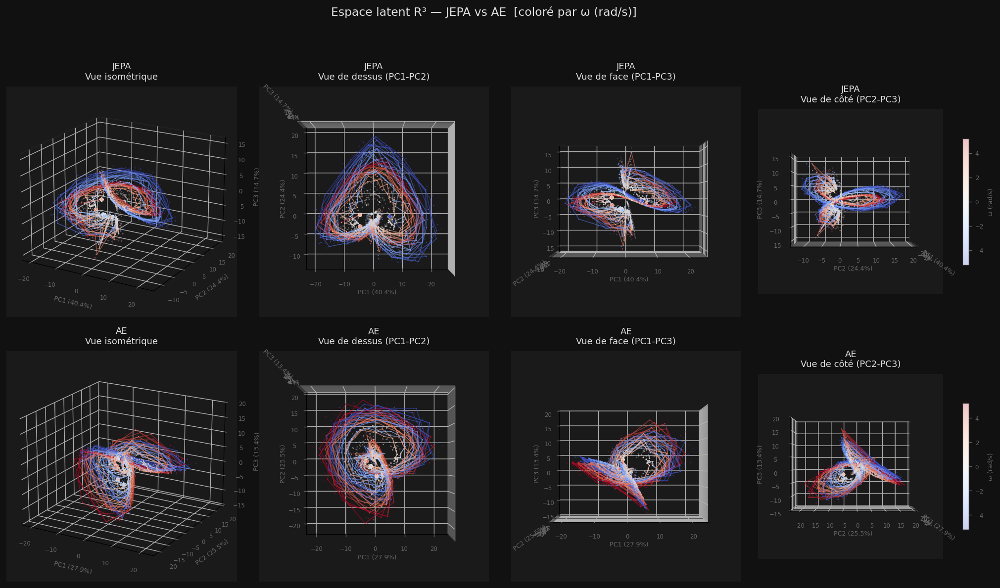

# JEPA vs Autoencoder World Model

Comparaison empirique de deux approches de world model sur pendule simple :
**JEPA** (prédiction dans l'espace latent) contre une **AE** (reconstruction pixel).

---

## Demos — dreaming 120 steps depuis 2 frames réelles

| JEPA | AE |
|:---:|:---:|
|  |  |
| real → imagined | real → imagined |

```bash
python3 jepa/imagine.py --gif --traj-idx 0 --n-steps 120 --fps 15 --out visuals/jepa_demo.gif
python3 rec/imagine.py  --gif --traj-idx 0 --n-steps 120 --fps 15 --out visuals/ae_demo.gif
```

---

## Espace latent R³ (PCA, 40 trajectoires)

Chaque courbe = une trajectoire.

**Coloré par θ (position angulaire)**


**Coloré par ω (vitesse angulaire)**


> Les trajectoires AE forment des courbes quasi-fermées : quand θ approche ±π, les frames se ressemblent visuellement (pendule proche du sommet), donc l'AE les rapproche dans l'espace latent. JEPA n'a pas cette information pixel — et comme le dataset ne contient que des oscillations (pas de tour complet), il n'apprend jamais que +π et −π sont la même position physique, d'où des courbes ouvertes.

```bash
python3 tools/visualize_latent_3d.py --model both --color theta --save visuals/latent3d_theta.png
python3 tools/visualize_latent_3d.py --model both --color omega --save visuals/latent3d_omega.png
```

---

## Résultats (probe linéaire z → θ, ω — val set)

> Les deux modèles ne sont pas strictement comparables : l'AE entraîne encodeur et décodeur conjointement avec VGG16 comme signal de supervision, tandis que le décodeur JEPA est entraîné séparément sur un encodeur gelé. Les gradients reçus par l'encodeur, leur nature et leur quantité diffèrent structurellement.

```
                    JEPA      AE
R²(θ)             0.966     0.976
R²(ω)             0.918     0.905
R²(mean)          0.942     0.940
```

> Une seule run, batch_size=32 (JEPA) vs 16 (AE — contrainte mémoire décodeur) — comparaison non contrôlée.

---

## Architectures

### JEPA — `models/jepa/model.py`

```
(frame_t, diff_t)  [6ch]
       ↓
  CNN encoder online  →  z_ctx ∈ R^128   [gradient]
  CNN encoder target  →  z_tgt ∈ R^128   [EMA, no grad]
       ↓
  MLP predictor  →  ẑ_{t+k}   k = 1…rollout_k

loss = (1/K) Σ [ cosine(ẑ_{t+k}, z*_{t+k}) + α·MSE ] + λ·SIGReg
```

### AE — `models/rec/model.py`

```
(frame_t, diff_t)  [6ch]
       ↓
  CNN encoder  →  z ∈ R^128
       ↓                    ↓
  Decoder  →  frame_hat    MLP predictor  →  ẑ_{t+k}
                                               ↓
                                           Decoder  →  frame_pred_{t+k}

loss = MSE(frame_hat, frame) + perceptual(VGG) + freq(FFT) + λ·SIGReg
```

### Composants partagés — `models/`

| Fichier | Rôle |
|---|---|
| `encoder.py` | `ContextEncoder` (CNN 4 couches) + `TargetEncoder` (EMA) |
| `decoder.py` | `Decoder` z → frame (ConvTranspose ×4) |
| `sigreg.py` | SIGReg — Epps-Pulley test, force z ~ N(0, I) |
| `losses.py` | `PerceptualLoss` (VGG16) + `FrequencyLoss` (FFT 2D) |

---

## Dataset

Pendule simple, 64×64 px, `states = [θ, ω]`.

```bash
python3 data/generate.py --n_trajectories 2000 --n_frames 500
python3 tools/browse.py        # navigateur interactif + portrait de phase
python3 tools/visualize.py     # grid de trajectoires
```

---

## Entraînement

```bash
# JEPA
python3 jepa/train.py --lam 0.5 --rollout-k 10 --epochs 50
python3 jepa/train_decoder.py --checkpoint checkpoints/jepa/lewm_best.pt

# AE
python3 rec/train.py --epochs 50 --batch-size 16
```

Colab : `jepa/notebooks/` · `rec/notebooks/`

---

## Évaluation

```bash
python3 eval/probe.py --compare                          # R²(θ,ω) JEPA vs AE
python3 eval/probe.py --compare --label-frac 0.1         # sample efficiency
python3 eval/compare.py                                  # viewer côte-à-côte
python3 tools/visualize_latent_3d.py --model both        # espace latent interactif
```

---

> **Références :**
> Maes et al., *"Le World Model"*, arXiv:2603.19312 (2026) · LeCun, *"A Path Towards Autonomous Machine Intelligence"* (2022) · Assran et al., *I-JEPA* (CVPR 2023)
