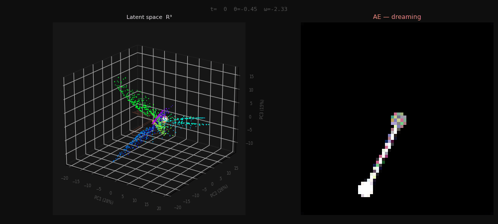
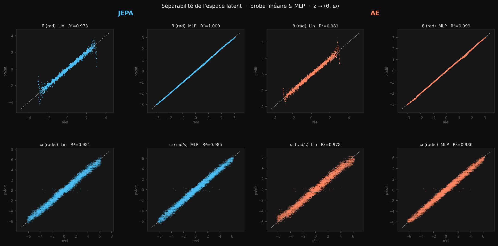

# JEPA vs Autoencoder World Model

Un **world model** apprend une représentation interne d'un environnement à partir d'observations brutes (pixels), et prédit comment cet environnement évolue dans le temps — sans jamais accéder aux variables physiques sous-jacentes.

Ce repo compare deux façons de construire cette représentation sur un pendule simple :
- **JEPA** prédit directement dans l'espace latent, sans jamais reconstruire de pixels
- **AE** reconstruit chaque frame et prédit dans l'espace latent via un décodeur partagé

Ce compromis se lit directement dans les demos : le pendule imaginé par JEPA suit une trajectoire dynamiquement cohérente mais reste visuellement flou, car son encodeur n'a jamais reçu de signal de reconstruction pixel. L'AE produit des frames plus nettes mais sa dynamique imaginée dérive plus vite — la supervision pixel contraint davantage la représentation vers l'apparence que vers la physique.

Inspiré de [LeCun (2022)](https://openreview.net/forum?id=BZ5a1r-kVsf), [I-JEPA — Assran et al. (CVPR 2023)](https://arxiv.org/abs/2301.08243) et [Le World Model — Maes et al. (2026)](https://arxiv.org/abs/2603.19312).

---

## Demos — dreaming 120 steps depuis 2 frames réelles

| JEPA | AE |
|:---:|:---:|
|  |  |
| real → imagined | real → imagined |

```bash
python3 jepa/imagine.py --gif --traj-idx 0 --n-steps 120 --fps 15 --out visuals/jepa_demo.gif
python3 rec/imagine.py  --gif --traj-idx 0 --n-steps 120 --fps 15 --out visuals/ae_demo.gif
```

---

## Dream Explorer — espace latent + rêve

Trajectoire dans l'espace latent R³ (PCA sur 20 trajectoires réelles) animée simultanément avec la frame décodée. La traîne colorée montre les derniers pas du rêve.

| JEPA | AE |
|:---:|:---:|
|  |  |

```bash
python3 tools/dream_explorer.py --model jepa --traj-idx 124 --save-gif visuals/dream_explorer_jepa.gif
python3 tools/dream_explorer.py --model rec  --traj-idx 124 --save-gif visuals/dream_explorer_ae.gif
```

Viewer interactif (sliders épisode / temps, rotation 3D) :
```bash
python3 tools/dream_explorer.py --model jepa
python3 tools/dream_explorer.py --model rec
```

---

## Espace latent R³ (PCA, 40 trajectoires)

Chaque courbe = une trajectoire. Couleur = θ (position angulaire).

| JEPA | AE |
|:---:|:---:|
|  |  |

> Les trajectoires AE forment des courbes quasi-fermées : quand θ approche ±π, les frames se ressemblent visuellement (pendule proche du sommet), donc l'AE les rapproche dans l'espace latent. JEPA n'a pas cette information pixel — et comme le dataset ne contient que des oscillations (pas de tour complet), il n'apprend jamais que +π et −π sont la même position physique, d'où des courbes ouvertes.

```bash
# GIF rotation 360°
python3 tools/visualize_latent_3d.py --model jepa --color theta --gif visuals/latent3d_jepa.gif
python3 tools/visualize_latent_3d.py --model rec  --color theta --gif visuals/latent3d_ae.gif

# Vues statiques (grille 4 angles)
python3 tools/visualize_latent_3d.py --model both --color theta --save visuals/latent3d_theta.png
python3 tools/visualize_latent_3d.py --model both --color omega --save visuals/latent3d_omega.png
```

---

## Séparabilité de l'espace latent



Encodeur gelé, sonde linéaire (lstsq) et MLP 2×256 entraînés sur z → (θ, ω). Les deux modèles donnent R²(θ) ≈ 0.97–0.98 et R²(ω) ≈ 0.98 en linéaire — l'état physique est directement lisible dans z. Le MLP remonte θ à ~1.000 pour les deux, révélant une légère courbure résiduelle ; l'écart lin→MLP reste faible et identique entre JEPA et AE, malgré des supervisions très différentes.

> Une seule run par modèle, conditions non contrôlées (batch_size, supervision VGG) — chiffres indicatifs.

```bash
python3 eval/scatter.py --compare --save visuals/separability.png
python3 eval/probe.py --compare                   # chiffres détaillés + gap lin→MLP
```

---

## Architectures

### JEPA — `models/jepa/model.py`

```
(frame_t, diff_t)  [6ch]
       ↓
  CNN encoder online  →  z_ctx ∈ R^128   [gradient]
  CNN encoder target  →  z_tgt ∈ R^128   [EMA, no grad]
       ↓
  MLP predictor  →  ẑ_{t+k}   k = 1…rollout_k

loss = (1/K) Σ [ cosine(ẑ_{t+k}, z*_{t+k}) + α·MSE ] + λ·SIGReg
```

### AE — `models/rec/model.py`

```
(frame_t, diff_t)  [6ch]
       ↓
  CNN encoder  →  z ∈ R^128
       ↓                    ↓
  Decoder  →  frame_hat    MLP predictor  →  ẑ_{t+k}
                                               ↓
                                           Decoder  →  frame_pred_{t+k}

loss = MSE(frame_hat, frame) + perceptual(VGG) + freq(FFT) + λ·SIGReg
```

### Composants partagés — `models/`

| Fichier | Rôle |
|---|---|
| `encoder.py` | `ContextEncoder` (CNN 4 couches) + `TargetEncoder` (EMA) |
| `decoder.py` | `Decoder` z → frame (ConvTranspose ×4) |
| `sigreg.py` | SIGReg — Epps-Pulley test, force z ~ N(0, I) |
| `losses.py` | `PerceptualLoss` (VGG16) + `FrequencyLoss` (FFT 2D) |

---

## Dataset

Pendule simple, 64×64 px, `states = [θ, ω]`.

```bash
python3 data/generate.py --n_trajectories 2000 --n_frames 500
python3 tools/browse.py        # navigateur interactif + portrait de phase
python3 tools/visualize.py     # grid de trajectoires
```

---

## Entraînement

```bash
# JEPA
python3 jepa/train.py --lam 0.5 --rollout-k 10 --epochs 50
python3 jepa/train_decoder.py --checkpoint checkpoints/jepa/lewm_best.pt

# AE
python3 rec/train.py --epochs 50 --batch-size 16
```

Colab : `jepa/notebooks/` · `rec/notebooks/`

---

## Évaluation

```bash
python3 eval/probe.py --compare                          # R²(θ,ω) JEPA vs AE
python3 eval/probe.py --compare --label-frac 0.1         # sample efficiency
python3 eval/compare.py                                  # viewer côte-à-côte
python3 tools/visualize_latent_3d.py --model both        # espace latent interactif
```

